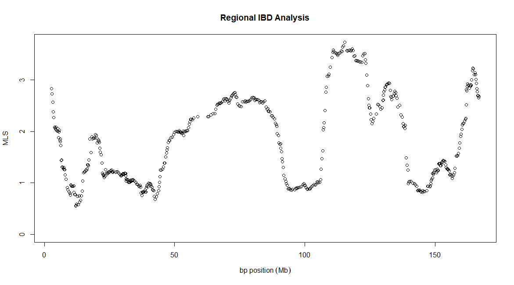

.. _example:

RIA Example
===========

This section runs through an example analysis using RIA with example data which can be download from `here <https://github.com/NewcastleRSE/RIA/blob/main/docs/exampleRIAData.zip>`_. This data was simulated using HAPMAP3 data to mate individuals who already had children to create 301 affected relative pairs (ARPs). The data only contains SNPs from chromosome 6, however in a real analysis we would ideally have data for the whole genome to get better estimates of the prior IBD sharing probabilities and to compare LOD scores across the genome.

We already have PLINK installed on our system so we will not bother ourselves to download it from `here <https://zzz.bwh.harvard.edu/plink/index.shtml>`_, nor will we use the `-plink` option as it is already set up to run by typing "plink", which is set by default. The KING program (version 2.2.9) on the other hand is not installed, so we shall download it from `here <https://www.kingrelatedness.com/history.shtml>`_, and save the executable file at location `/home/me/my-programs/king/` so that KING may be ran by typing `/home/me/my-programs/king/king`. **Note:** It is very important to download KING version 2.2.9 and not any later versions as we need to use the `--homog` option which is no longer available in later versions.

We can now run a Regional IBD Analysis (RIA) analyses using the default options for the SNP window size, set to 15 cM, and the SNP window step size, set to 50, by typing:

.. code-block:: none

    ./ria -king /home/me/my-programs/king/king -i exampleRIAData.bed -o resultsRIAExample.dat

This will create output similar to the following.

.. code-block:: none

    RIA: Regional IBD Analysis, v1.1
    ------------------------------------------------------------
    Copyright 2015-present Richard Howey, GNU General Public License, v3
    Research Software Engineering, Newcastle University

    Parameters:
    Input file: demo-data/exampleRIAData.bed
    Output file: resultsRIAExampleDataKing2023.dat
    Log file: resultsRIAExampleDataKing2023.log
    Using additive and dominance variance model
    Start at first SNP with full SNP window
    End at last SNP with full SNP window
    Window size: 15 cM
    Minimum number of SNPs in a window: 100
    SNP step size: 50 SNPs
    Number of cases: 362
    Number of unused controls: 35
    Number of SNPs: 29413

    Creating list of pruned SNPs using PLINK command:
    plink --noweb --indep 50 50 2 --mind 0.01 --maf 0.25 --geno 0.05 --bfile exampleRIAData --out tempRIA-priors1-8553 >/dev/null 2>&1

    Creating data file to calculate priors using PLINK command:
    plink --noweb --bfile exampleRIAData --filter-cases --extract tempRIA-priors1-8553.prune.in --make-bed --out tempRIA-priors2-8553 >/dev/null 2>&1

    Calculating priors using KING command:
    /home/me/my-programs/king/king -b tempRIA-priors2-8553.bed --homog --prefix tempRIA-priors2-8553 >/dev/null 2>&1

    Number of affected relative pairs (ARPs) in priors: 301

    Calculating posteriors (for each SNP window) using KING command:
    /home/me/my-programs/king/king -b tempRIA-posterior-8553.bed --homog --prefix tempRIA-posterior-8553 >/dev/null 2>&1

    15 cM windows - number of SNPs summary statistics:
    Mean: 2442.33
    Median: 2266
    Standard deviation: 606.466
    Range: (1458, 3634)

    Run time: 10 minutes

The commands used by PLINK and KING are output for reference and may be useful if there are any problems. RIA uses several intermediate temporary files beginning with "tempRIA" and may be lying around if there was a problem and RIA was forced to unexpectedly stop. They should then be carefully deleted if necessary.

The results file `resultsRIAExample.dat` should look as follows:

.. code-block:: none
        
    SNP CHR ID CM BP VAR_A VAR_D MLS
    741 6 rs11755767 7.52007 2804601 1.583936049 0 2.828838716
    791 6 rs7765538 8.14908 3000876 1.544010298 0 2.726726528
    841 6 rs744375 8.85487 3294907 1.473726461 0 2.565180586
    891 6 rs7763703 9.47382 3433624 1.392624092 0 2.383495002
    941 6 rs12526106 10.0032 3690722 1.339150984 0 2.272297645
    ...
    28341 6 rs11755875 188.372 166136328 1.21271465 0.1564407936 2.774211867
    28391 6 rs705791 188.972 166288440 1.127065043 0.1950593781 2.693304349
    28441 6 rs12154075 189.175 166486261 1.12910064 0.1965589048 2.69542933
    28491 6 rs1033725 189.362 166627240 1.125312283 0.1817039321 2.647993295
    28541 6 rs6935542 190.191 166817722 0.9200496884 0.3786320582 2.675835187

The columns for the results file are as follows:

+-----------+---------------------------------------+
| Column    | Description                           |
+===========+=======================================+
| SNP       | The SNP number as it appears in file. |
| CHR       | Chromosome of the SNP.                |
| ID        | The name of the SNP.                  |
| CM        | The centimorgan value of the SNP.     |
| BP        | The base pair position of the SNP.    |
| VAR_A     | The additive variance parameter.      |
| VAR_D     | The dominance variance parameter.     |
| MLS       | The maximum-likelihood statistic.     |
+===========+=======================================+

It is not unusual for either `VAR_A` or `VAR_D` or even both of these parameters to be equal to 0. In the example data set `VAR_D` is equal to 0 for most of the SNPs.

In R type:

.. code-block:: none

    resultsRIAExample<-read.table("resultsRIAExample.dat", header=TRUE)

    plot(resultsRIAExample$BP/10^6, resultsRIAExample$MLS, main="Regional IBD Analysis", xlab=expression(bp~position~(Mb)), ylab="MLS", ylim=c(0, max(resultsRIAExample$MLS)))

This will produce the following plot:

.. _example-fig:

    Plot of RIA test results.

As the prior IBD sharing probabilities are always the same, regardless of which subset of SNPs are analysed, it is possible to save a prior file using the `-o-prior` option as follows

.. code-block:: none

    ./ria -king /home/me/my-programs/king/king -i exampleRIAData.bed -o resultsRIAExample.dat -o-prior examplePrior.dat

or can be done without any further analysis using the `-prior-only` option as follows

.. code-block:: none

    ./ria -king /home/me/my-programs/king/king -i exampleRIAData.bed -prior-only -o-prior examplePrior.dat

The prior can then be used for different analysis using the `-i-prior` option, such as

.. code-block:: none

    ./ria -window-size 2000 -king /home/me/my-programs/king/king -i exampleRIAData.bed -o resultsRIAExample-2000.dat -i-prior examplePrior.dat

There are no simulated effects in the example data, which would be clearer if results for the whole genome were available. For details on how to interpret results please see :cite:`nat:15`.

.. _parallel:

Parallel processing
-------------------

Regional IBD Analysis is fairly computationally intensive and so it is natural to want to speed things up a bit by using parallel processing. This can be done by dividing the analysis up using the `-start-snp` and `-end-snp` options, such as

.. code-block:: none

    ./ria -king /home/me/my-programs/king/king -i exampleRIAData.bed -o resultsRIAExample1.dat -i-prior examplePrior.dat -start-snp 3000 -end-snp 4000

Care must be taken when setting the first SNP to ensure there is a full SNP window around the SNP at the center of the SNP window.

If all of the data is to be analysed it is much easy to use the `-job` option to divide the analysis into a number of analyses. This will automatically set the start and end SNPs. For example, to analyse all of the data in 10 jobs using the previously calculated priors, use

.. code-block:: none
        
    ./ria -king /home/me/my-programs/king/king -i exampleRIAData.bed -o results1.dat -i-prior examplePrior.dat -job 1 10
    ./ria -king /home/me/my-programs/king/king -i exampleRIAData.bed -o results2.dat -i-prior examplePrior.dat -job 2 10
    ./ria -king /home/me/my-programs/king/king -i exampleRIAData.bed -o results3.dat -i-prior examplePrior.dat -job 3 10
    ./ria -king /home/me/my-programs/king/king -i exampleRIAData.bed -o results4.dat -i-prior examplePrior.dat -job 4 10
    ./ria -king /home/me/my-programs/king/king -i exampleRIAData.bed -o results5.dat -i-prior examplePrior.dat -job 5 10
    ./ria -king /home/me/my-programs/king/king -i exampleRIAData.bed -o results6.dat -i-prior examplePrior.dat -job 6 10
    ./ria -king /home/me/my-programs/king/king -i exampleRIAData.bed -o results7.dat -i-prior examplePrior.dat -job 7 10
    ./ria -king /home/me/my-programs/king/king -i exampleRIAData.bed -o results8.dat -i-prior examplePrior.dat -job 8 10
    ./ria -king /home/me/my-programs/king/king -i exampleRIAData.bed -o results9.dat -i-prior examplePrior.dat -job 9 10
    ./ria -king /home/me/my-programs/king/king -i exampleRIAData.bed -o results10.dat -i-prior examplePrior.dat -job 10 10

The temporary intermediate files used by RIA depend on the process ID of each job so there is no need to worry about these files interfering with one another.
Only the first results file will contain the header making it easy to combine the results into one results file:

.. code-block:: none

    cat results1.dat results2.dat results3.dat results4.dat results5.dat results6.dat results7.dat results8.dat results9.dat results10.dat > allResults.dat

The `-job` option makes it easy to write a simple script with a loop to submit the jobs. Alternatively, if you are using a High Performance Computing (HPC) cluster using the open-source Sun Grid Engine (SGE) scheduler software, then these jobs may be submitted as an array job using something similar to the following script:

.. code-block:: none

    #!/bin/bash
    # execute in current working directory
    #$ -cwd
    # export local envirnoment
    #$ -V
    # the number of RIA tasks
    #$ -t 1-10
    # execute RIA for each task
    ./ria -king /home/me/my-programs/king/king -i exampleRIAData.bed -o results$SGE_TASK_ID.dat -i-prior examplePrior.dat -job $SGE_TASK_ID 10

